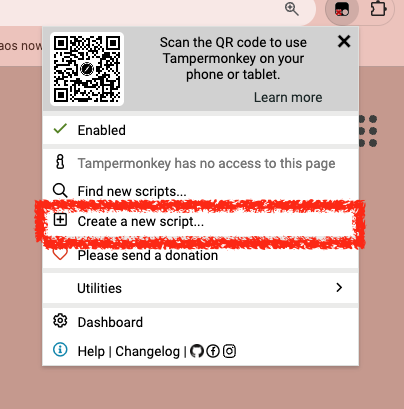
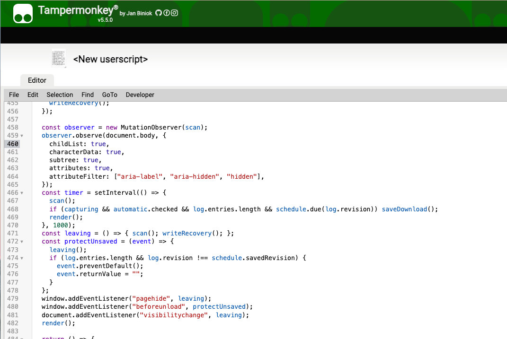
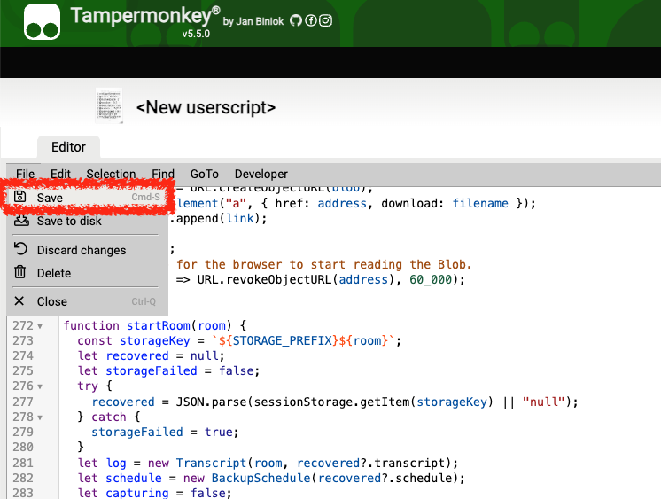

# Google Meet Transcript

[All userscripts](../README.md)

## About this script

A Tampermonkey userscript that starts capturing Google Meet captions automatically, backs up the full transcript every 30 minutes, and downloads remaining changes when the meeting ends. Captured entries remain available after Meet removes older captions, with a local recovery copy for closed tabs.

## How to setup

### Step 1. Install Tampermonkey

Install [Tampermonkey](https://www.tampermonkey.net/) in Chrome or Edge and enable userscripts if the extension prompts you to do so.

### Step 2. Add the script

Open Tampermonkey → **Create a new script**:



Replace the editor contents with [google-meet-transcript.user.js](google-meet-transcript.user.js):



Then select **File → Save**:



### Step 3. Enable captions

Join a Google Meet meeting, turn on captions, and select the correct spoken language in Meet. The **Meet transcript** panel starts capturing automatically, including after a page reload; use **Pause** and **Record** to pause or resume.

Click **Meet transcript** to collapse or expand the panel. The recording status and button stay visible: a red dot, **Recording**, and a red **Pause** button indicate active caption capture; **Not recording** appears when paused, finished, or waiting for Meet captions to be enabled.

The script recognizes caption-panel labels in English, Japanese, and Korean. Under **Options**, you can optionally set the name used for “You”, “あなた”, or “나” in downloaded files.

### Step 4. Allow automatic downloads

Leave **Auto-download every 30 minutes** enabled. If the browser asks whether Meet may download multiple files, allow it in the site's automatic-download settings.

Captions are collected as they appear, and recovery copies are saved to this tab's session storage and the browser's local storage within about half a second of a change. Every 30 minutes, the script requests a download of the **complete log**, including captions Meet has already removed. Unchanged logs do not create duplicate backups; a manual download restarts the 30-minute interval. If a background timer runs late, one backup is requested when it next runs.

Choose **Text**, **Markdown**, or **JSON** for both manual and automatic downloads. Check your Downloads folder to confirm the browser allowed the files; the panel reports download requests, not successful disk writes.

### Step 5. Leave the meeting

**Auto-download remaining captions when done** is checked by default. Clicking Meet's **Leave call** button or reaching a recognized meeting-ended screen requests a final download immediately, without a script confirmation. The final file contains the **full log**, including the last captions, and has `-final` in its name; if nothing changed since the last download, it is skipped.

Closing or navigating away from the tab also attempts this download, but browsers can block downloads during page teardown or skip those events entirely. **A tab-close download cannot be guaranteed.** Allow automatic downloads in the browser, or click **Download full log** before closing when you need to confirm it was saved.

If the tab closes without a file, reopen the same meeting in the same browser profile: the last local recovery copy is restored automatically. **New log** clears this room's recovery copy after confirmation, so download anything you need first.

## Limits

- Keep the Meet tab open and captions enabled; speech that was never rendered, appeared before capture, or was removed while the tab was suspended cannot be recovered
- The script collects caption text; it does not generate a meeting summary or record audio
- Persistent recovery keeps the latest saved log per room in this browser profile; clearing site data, private browsing, storage restrictions, or a full storage quota can remove or prevent it, so downloaded files remain the archive
- Caption edits update the corresponding entry; timestamps show when text was first observed, in UTC
- Meet's page structure can change, so caption detection may need an update; this version is tested against simulated caption panels, not a live call
- The userscript makes no network requests; its recovery data is stored in Meet's session and local storage and can be accessed by scripts on that origin

## Development

Requires Node.js 22 or newer; no dependency installation is needed. Run these commands from this directory, or from the repository root to check all userscripts:

```sh
npm test
npm run build
npm run check
npm run test:browser
```

The browser check uses an installed Chrome or Chromium with a fresh temporary profile and local caption fixtures. Set `CHROME_BIN` to your browser executable if it is not found automatically.

Edit `src/`, then rebuild the installable userscript. `src/captions.js` contains the Meet DOM adapter; `src/transcript.js` contains transcript history, export formats, and backup scheduling.
